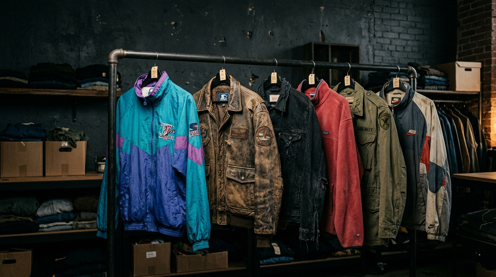

# 🧥 Drip Room — Premium Curated Thrift Jackets

> A modern, conversion-focused thrift fashion e-commerce storefront built with vanilla HTML, CSS & JavaScript.



---

## 🌐 Live Preview

> Run locally → `http://localhost:5500`

---

## ✨ Features

- **Dark Fashion + Subtle Neumorphism UI** — `#0c0d0e` canvas with warm cream accents and layered soft shadows
- **14 Curated Archive Jackets** — Nike, Carhartt, Arc'teryx, Stone Island, Stüssy, TNF, Ralph Lauren & more
- **5-Tier Condition Transparency** — NEW / LIKE NEW / EXCELLENT / GOOD / MINOR FLAW with per-item inspection reports
- **Persistent Cart & Wishlist** — localStorage across all pages, live badge counters
- **Advanced Filtering** — category, size, condition, price range slider + keyword search
- **Multi-Angle Product Gallery** — thumbnail navigation with zoom on the PDP
- **3-Step Checkout** — Address → Delivery → Payment (UPI · Card · COD · Net Banking)
- **Promo Code Support** — `DRIP10` gives 10% off at checkout
- **Mobile-First Responsive** — slide-in drawer navigation on all pages
- **SVG Icon System** — all header icons are inline SVGs matching the dark palette

---

## 📁 Project Structure

```
Drip-Room/
├── index.html              # Homepage — hero, categories, trending drops
├── product-listing.html    # Shop vault — filters, sort, search, grid
├── product-detail.html     # Single product — gallery, measurements, condition
├── cart.html               # Shopping bag — items, promo, order summary
├── checkout.html           # 3-step checkout — address, delivery, payment
├── styles.css              # Full design system — dark palette, neumorphism, components
├── main.js                 # Master engine — catalog, cart, wishlist, filters, routing
├── hero-jackets-hanging.jpg# Hero background image
└── .gitignore
```

---

## 🚀 Running Locally

No build step needed — pure HTML/CSS/JS.

### Option 1 — Python (recommended)
```bash
cd Drip-Room
python -m http.server 5500
# Open http://localhost:5500
```

### Option 2 — VS Code Live Server
Install the **Live Server** extension → right-click `index.html` → **Open with Live Server**

### Option 3 — Node.js
```bash
npx serve .
```

---

## 🎨 Design System

| Token | Value | Usage |
|---|---|---|
| `--bg-main` | `#0c0d0e` | Page canvas |
| `--bg-surface` | `#141517` | Cards, panels |
| `--accent-cream` | `#e8dfcf` | Primary accent, hover states |
| `--accent-amber` | `#c89547` | Price highlights |
| `--font-display` | Space Grotesk | Headings, logo |
| `--font-body` | Inter | Body copy |

---

## 🏷️ Jacket Categories

| Category | Examples |
|---|---|
| Windbreakers | Nike 90s Ripstop, Patagonia Torrentshell |
| Workwear | Carhartt Detroit, Dickies Eisenhower |
| Bombers & Varsity | Ralph Lauren Letterman, MA-1 Satin |
| Technical Shells | Arc'teryx Beta LT, Stone Island Raso |
| Puffers | TNF 1996 Nuptse, CP Company Down |
| Track Jackets | Adidas 80s Trefoil, Fila Heritage |
| Fleece & Sherpa | Stüssy Reversible, Levi's Sherpa Trucker |
| Leather | Diesel Moto Biker, Barbour Wax |

---

## 💳 Checkout

- **Promo code:** `DRIP10` → 10% off
- **Free shipping** on orders ₹2,499+
- Payment: UPI · Cards · Cash on Delivery · Net Banking

---

## 🛠️ Tech Stack

- **HTML5** — semantic markup, ARIA labels
- **CSS3** — custom properties, neumorphic shadows, `@keyframes` animations
- **Vanilla JavaScript (ES6+)** — no frameworks, no dependencies
- **Google Fonts** — Space Grotesk + Inter
- **Unsplash** — high-quality jacket photography

---

## 📄 License

MIT © 2026 Drip Room Inc. — Ooty, Tamil Nadu, India.
